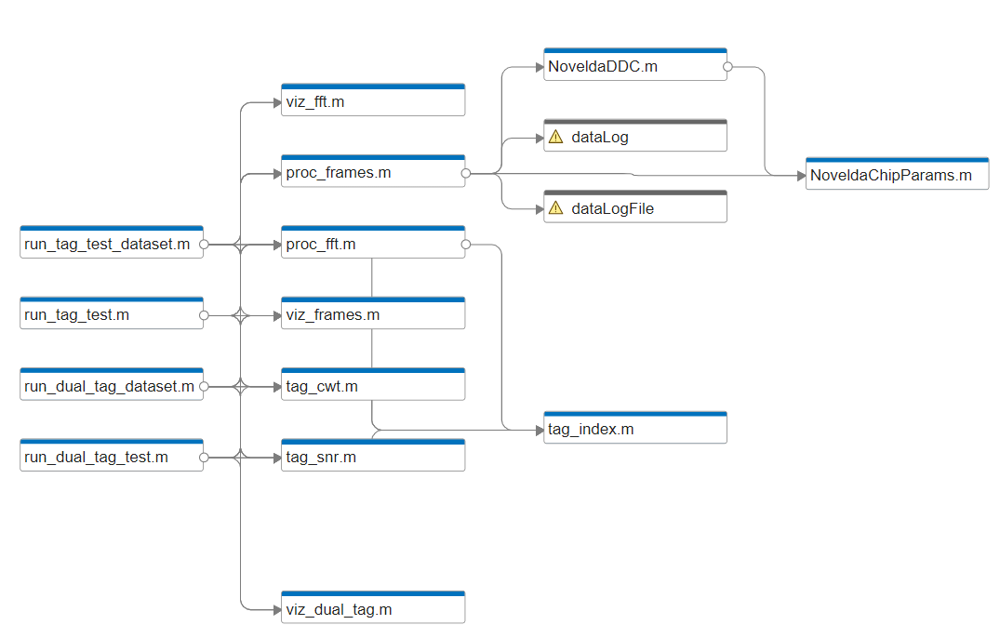

# MATLAB Code for Radar Interface

> __Note:__  
> README last updated August 2025

Welcome to the MATLAB code repository for interfacing with captured radar data. If you are new here, we recommend starting with the `TestFrames.mlx` live script or other `Test*.m` functions to understand the DSP pipeline.


*Visualization of DSP dependencies for an example run*

## Directory Organization

### Core Directories
```
├── data/                       # Example data (more in /04_data)
├── Examples/                   # Reference Novelda example code                         
├── legacy/                     # Deprecated MATLAB code
├── sim/                        # Simulation scripts
```

### Main Function Groups

#### Data Acquisition and Processing
```
├── Capture*.m                  # Data acquisition from radar hardware
├── Process*.m                  # Core signal processing (FFT, frames)
├── Preprocess*.m               # Data preparation and filtering
├── Novelda*.m                  # Novelda-provided utilities for DDC processing
```

#### Dataset Management and Analysis
```
├── Dataset*.m                  # Dataset processing, calibration, and analysis tools
├── Image*.m                    # Image processing and conversion utilities
├── Frames2CSV.m                # Data export to CSV format
```

#### Tag Detection and Sensing
```
├── Tag*.m                      # Backscatter tag detection and analysis
├── Sense*.m                    # Range bin to VWC conversion using calibrations
├── Calibrate*.m                # Calibration tools for range bins and VWC
```

#### Visualization and Testing
```
├── Plot*.m                     # Data visualization functions
├── Test*.m                     # Example scripts and test harnesses
├── *.mlx                       # Live scripts for interactive analysis
```

#### Demo Applications
```
├── demo.m                      # Demo from "Enabling Sustainable Sensor Networks" seminar
                                    (https://www.youtube.com/watch?v=WrSQfxIoFWw)
├── demoDualTag.m               # Dual tag erosion robustness demo
├── ChipotleRadarTester.m       # Validation suite for new radar hardware
```

### Key Live Scripts (.mlx)
- `TestFrames.mlx`: Interactive exploration of radar frame processing
- `SoilCompactionNotebook.mlx`: Analysis of soil compaction measurements
- `CalibrateRangeBin2VWC.mlx`: Range bin to VWC calibration workflow
- `rangebin2raw.mlx`: Range bin to raw data conversion utilities