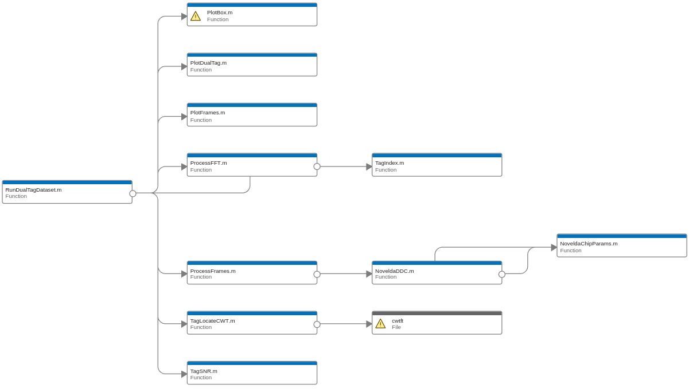

# MATLAB Code for Radar Interface

Welcome to the MATLAB code repository for interfacing with radar(s). This codebase primarily interacts with FlatEarth libraries, demo code, and the WADAR scripts. If you are new here, I'd recommend looking at the *test*.m* functions first to get an idea of how to use this MATLAB codebase.


*Visualization of the DSP pipeline*

## Directory Structure

```
├── data                        # Example data. More can be found in 
                                  https://github.com/jlab-sensing/wadar/tree/master/04_data
├── Examples                    # Unused Novelda example MATLAB code                         
├── legacy                      # Contains obsolete MATLAB code
├── sim                         # Simulation scripts
├── Capture*.m                  # Functions to acquire radar frames by running commands on the radar
├── ChipotleRadarTester.m       # WIP: Function to follow the V&V plan for newly fabricated radars
├── demo.m                      # Automated script used in the seminar "Enabling Sustainable Sensor Networks with 
                                  Microbe-powered RF Backscatter" by Dr. Colleen Josephson. Watch the seminar at 
                                  https://www.youtube.com/watch?v=WrSQfxIoFWw
├── demoDualTag.m               # Automated script used to demo dual tag system's robustness to erosion
├── Novelda*.m                  # Files provided by Novelda to extract useful information and apply apply DDC processing
├── Plot*.m                     # Visualization functions to plot useful information
├── Run*.m                      # Functions to run DSP pipeline on specified files or folders
├── Sense*.m                    # Functions to convert range bins to useful sensing metrics using LS calibrations
├── Tag*.m                      # Functions to extract information about the backscatter tag
├── Test*.m                     # Examples of DSP pipeline operations
```